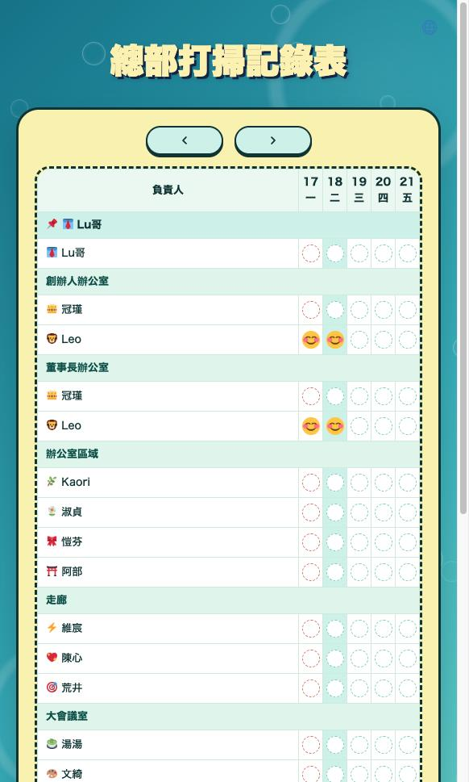

# souji

總部打掃記錄表 —— 用來記錄月度清掃打勾狀態的網頁應用,支援日文 / 繁體中文切換。

線上網址:[jptip.cc/souji](https://jptip.cc/souji)



以 Cloudflare Pages + Pages Functions + D1 建置。

## 專案結構

- `index.html` —— 清掃記錄表畫面(前端)
- `functions/api/checks/[key].js` —— 各月份清掃打勾狀態的存取 API(`GET`/`POST` `/api/checks/:key`,`key` 格式為 `YYYY-MM`)
- `migrations/` —— D1 資料庫的 migration(`checks` 資料表)
- `wrangler.jsonc` —— Pages / D1 綁定設定

## 開發

```bash
npm install
npm run dev
```

在 `http://localhost:8888` 即可預覽。

## 部署

```bash
npm run deploy
```

部署到 Cloudflare Pages。需要先綁定好 D1 資料庫(`souji-db`)。
